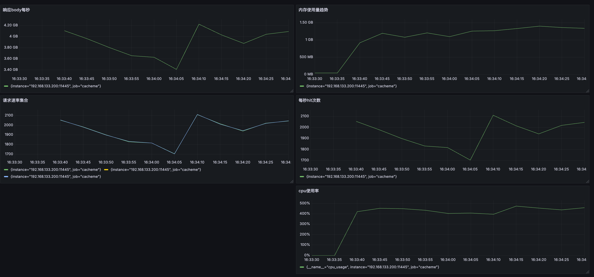

# CacheMe

**CacheMe** 是一个用 Rust 构建的高性能、可缓存的 HTTP 代理服务器，基于 Tokio 异步运行时，专为边缘缓存、静态文件分发与开发调试场景设计。


---

## ✨ 特性

- 🚀 基于 Tokio 实现的全异步 HTTP 代理
- 🧠 支持 HTTP Range 请求，自动限速读取
- 🧊 本地磁盘缓存静态内容
- 🔁 配置简单，秒级部署
- ♻️ 自动定时垃圾回收（GC）
- 合并回源

---

## 🔧 配置方式

你只需要一个 JSON 文件即可启动服务：

### 示例 `config.json`

```json
{
  "http_bind": "0.0.0.0:11345",
  "http_control_bind": "127.1:11445",
  "temp_dir": "./tmp/",
  "gc_interval": "100m",
  "cache_zone": [
    {
      "path": "cache_zone0"
    }
  ],
  "sled": {
    "path": "./metadata"
  },
  "acl": [
    {
      "host": "doc.example.com",
      "path_match": "/*",
      "kind": "Cache",
      "allow_method":["GET","HEAD"]
    },
    {
      "host": "api.example.com",
      "path_match": "/*",
      "kind": "Proxy"
    }
  ]
}
```
## 压缩算法支持
- **gzip**

## 基准测试（Benchmark）

使用 [wrk](https://github.com/wg/wrk) 工具对 2Mib 文件全hit进行压测，环境为 Apple M1 Pro. CacheMe占用 5 核 CPU，wrk 2 线程，200 并发连接，持续 60 秒：

```bash
wrk -t2 -c200 -d60s http://127.0.0.1:11345/test.dat -H 'Host: example.com'

```

